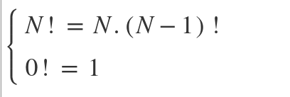

# CÁC KHÁI NIỆM CĂN BẢN VỀ PHÂN TÍCH VÀ THIẾT KẾ GIẢI THUẬT
---
## Đệ quy và hệ thức truy hồi  
- Chương trình đệ quy là một chương trình có thể gọi lại chính nó (trực tiếp hay gián tiếp)
- Yếu tố then chốt của chương trình đệ quy đó chính là điều kiện dừng. Nếu điều kiện dừng không chặt chẽ thì chương trình của chúng ta có thể bị lặp vô hạn hoặc cho ra kết quả thực thi không như mong muốn.
### Hệ thực truy hồi
- Là dạng thức đơn giản nhất ở dạng các hệ thức truy hồi.
- Hàm  đệ quy chứa đối số nguyên chính là những hệ thức truy hồi.
- Một hệ thức truy hồi thường chứa 2 trường hợp:
    - Một trường hợp đệ quy
    - Một trường hợp căn bản
- Ví dụ 1: Hệ thức truy hồi  
  
Trong đó, N! = N.(N-1)! là trường hợp đệ quy, và 0! = 1 là trường hợp căn bản  

### So sánh đệ quy đệ quy và lăp  
- Trong thực tế, giải thuật lặp không đệ quy thường làm việc hữu hiệu và dễ kiểm soát hơn đệ quy. Ví dụ như việc phát hiện và sửa lỗi sai trong chương trình lặp dễ hơn so với chương trình đệ quy.  
- Trong quá trình thiết kế giải thuật, lúc đàu xây dựng giải thuật đệ quy nhờ hệ thưc struy hồi, sau đó chúng ta nên nghĩ cách chuyển đổi giải thuật đệ quy về giải thuật lặp tương đương để tận giải thuật hiệu quả hơn.  
- Chúng ta hoàn toàn có thể chuyển giải thuật đệ quy thành giải thuật lặp nhờ cấu trúc stack

## Phân tích độ phức tạp giải thuật  
- Phân tích độ phức tạp giải thuật là dự đoán các tài nguyên mà giai rthuataj đó cần.
- Tài nguyên bao gồm chỗ bộ nhớ và thời gian.
- Trong 2 loại tài nguyên trên, thời gian tính toán là tài nguyên quan trọng nhất.  

### Kích thước của dữ liệu nhập
Chúng ta có thể thấy, giải thuật chạy càng chậm trên những bộ dữ liệu càng lớn. Do đó, có thể xem độ hữu hiệu của một giải thuật là một hàm của thông số N nào đó diễn tả kích thước dữ liệu nhập  

### Hai cách phân tích  
Chúng ta cần phải đi ước lượng lượng tài nguyên mà giải thuật cần để thực thi các input tương ứng.  

- **Trường hợp trung bình**: Độ phức tạp là thời gian tính toán mà 1 giải thuật cần đối với một tập dữ liệu tiêu biểu  
- **Trường hợp xấu nhất**: Độ phức tạp là thời gian tính toán mà 1 giải thuật chạy với bộ dữ liệu nhập lớn nhất hay với dữ liệu này thì số thao tác thực hiện là lớn nhất. Trường hợp này lượng tài nguyên cần là lớn nhất.  
- Ngoài ra, ta còn có thể quan tâm đến trường hợp tốt nhất. Độ phức tạp là thời gian tính toán mà 1 giải thuật cần đối với "dữ liệu nhập tốt nhất" có thể (ngược với trường hợp xấu nhất).  
- Ví dụ về trường hợp xấu nhất, chúng ta có thể xét bài toán sắp xếp 1 mảng các số nguyên cho trước theo thứ tự tăng dần. Trường hợp xấu nhất ở đây là mảng đã cho gồm các số nguyên đã được săp xếp theo thứ tự giảm dần.  

### Khung phân tích độ phức tạp giải thuật.
Thường, chúng ta sẽ làm 3 bước:  
- Bước 1: Đặc trưng hóa dữ liệu nhập và quyết định kiểu phân tích giải thuật thích hợp. Tức là ta sẽ xác định:  
    - Dữ liệu nhập có bao input, mỗi input có bao nhiêu phần tử.  
    - Xác định kiểu phân tích là gì? (xấu nhất, tốt nhất hay trung bình)  
Trường hợp lí tưởng, chúng ta mong muốn từ phân bố xác suất của dữ liệu nhập, ta có thể sinh ra phân bố xác suất của thời gian thực thi tương ứng.
Tuy nhiên, với những giải thuật khó, việc mong muốn như trên là hoàn toàn không thể. Khi đó, chúng ta sẽ tập trung chương minh thời gian thực thi sẽ nhỏ hơn cận trên nào đó.
Bước 2: Nhận dạng các thao tác căn bản của giải thuật (có thể được gọi là phép toán trừu tượng của giải thuật). Thao tác căn bản của giải thuật là phép toán chính của giải thuật, chiếm trọng số sử dụng tài nguyên nhiều nhất.
Bước 3: Thực hiện phân tích toán học để ước lượng lượng tài nguyên cần sử dụng. Chúng ta sẽ tiến hành thiết lập một hàm để ước lượng lượng tài nguyên cần sử dụng với những thông số nhập mà chúng ta đã chuẩn hóa được ở bước 1.  
### Phân lớp độ phức tạp  
- Hầu hết các giải thuật thường có 1 thông só chính N (kích thước dữ liệu nhập được xử lý )  
- Các loại độ phức tạp:  

| Name | Type |
| :---: | :---: |
| 1 | Hằng số |
| lgN | Logarit |
| N | Tuyến Tính |
| NlgN | Tuyến tính Logarit |
| N^2 | Bình Phương |
| N^3 | Lập Phương |
| 2^N | Luỹ Thừa |
| N! | Giai thừa |  

- Giải thuật có độ phức tạp hàm mũ chỉ nên sử dụng cho những bài toán có kích thước dữ liệu khá nhỏ.  

### Độ phức tạp tính toán
- Tập trung vào phân tích trường hợp xấu nhất. Khi phân tích bỏ qua những thừa số hằng số để xác định sự phụ thuộc hàm của thời gian tính toán đối với kích thước dữ liệu nhập.  
- Một hàm f(n) được gọi là O(g(n)) nếu tồn tại 2 hằng số c và n0 sao cho f(n) < c.g(n) Với mọi n > n0  
- Phân tích đọ phức tạp trường hợp trung bình, ta phải:  
    1. Đặc trưng hóa dữ liệu nhập của giải thuật
    2. Tính giá trị trung bình của tổng só olanaf tác vụ căn bản được thực thi trong giải thuật
    3. Suy ra thời gian tính toán trung bình của toàn giải thuật.

### Các kết quả tiệm cận và xấp xỉ  

## Phân tích giải thuật lặp
## Phân tích giải thuật đệ quy
## Nguyên tắc phân tích độ phức tạp trung bình  
Để phân tích độ phức tạp trung bình của một giải thuật A, ta phải làm một số bước theo trình tự sau đây:  
1. Quyết định một *không gian lấy mẫu* (sampling space) để diễn tả những trường hợp mà dữ liệu đầu vào (kích thước n) có thể có. Giả sử không gian lấy mẫu là S = {I1, I2,..., Ik}  
2. Định nghĩa một phân bố xác suất p trên S nhằm biểu diễn chắc chắn mà dữ liệu đầu vào đó có thể xảy ra.  
3. Tính tổng số tác vụ căn bản được giải thuật A thực hiện để xử lý một trường hợp mẫu. Ta dùng v(Ik) ký hiệu tổng số tác vụ được thực hiện bởi khi dữ liệu đầu vào thuộc trường hợp Ik.  
4. Ta tính trị trung bình của số tác vụ căn bản bằng cách tính kỳ vọng sau:  
`Cavg(n) = v(I1)p(I1) + v(I2)p(I2) + ... + v(Ik)p(Ik)`

